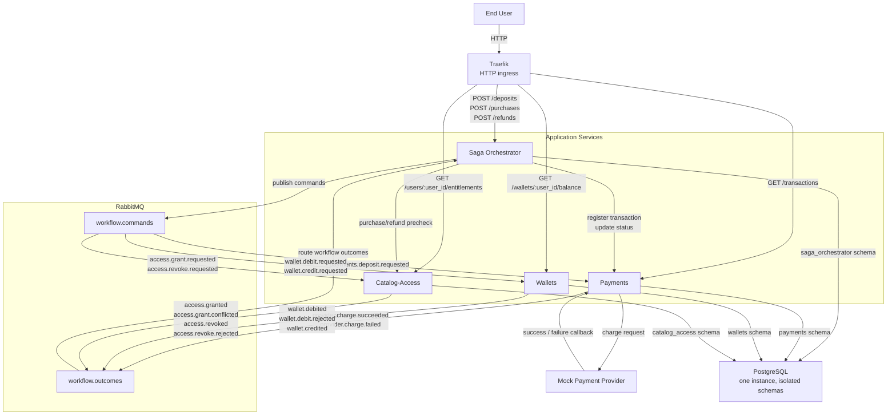

# Architecture

## Overview

The system is organized as a small event-driven platform with one orchestrator,
three domain services, one broker, one database instance, and Traefik as the
HTTP ingress layer.

The main design rule is strict ownership:

- `payments` owns transactions and provider integration
- `wallets` owns balances and wallet movements
- `catalog-access` owns users, offerings, and access records
- `saga-orchestrator` owns workflow state and progression only

## Runtime Topology

## Communication Model

### External HTTP

Traefik is the single ingress point. It only routes requests; it does not
contain workflow logic.

### Synchronous Internal HTTP

The orchestrator uses direct internal HTTP for steps that need an immediate
authoritative answer before the workflow continues:

- transaction registration and status updates in `payments`
- purchase and refund prechecks in `catalog-access`

This keeps the ledger and eligibility decisions owned by the right service
without forcing those decisions through asynchronous request-response emulation.

### Asynchronous Messaging

RabbitMQ carries workflow commands and outcomes.

This is where the distributed behavior lives:

- start a debit or credit
- grant or revoke access
- react to provider outcomes
- continue, compensate, or terminate a saga

## Why This Shape Works

### Clean Ownership

The orchestrator coordinates but does not own balances, pricing, access rules,
or provider logic.

### Auditable Money Flow

The transaction ledger is centralized in `payments`, while wallet-side effects
remain fully traceable through `wallet_movements`.

### Concurrency Safety

The design keeps the highest-risk concurrency rules inside the services that own
the mutable state:

- wallet row locks in `wallets`
- unique active access and unique transaction grants in `catalog-access`
- legal status transitions in `payments`
- step-gated outcome processing in `saga-orchestrator`

### Pragmatic Challenge Scope

One PostgreSQL instance and one RabbitMQ broker keep the system realistic but
still runnable locally. Schemas remain isolated so future extraction to separate
database instances stays feasible.

## Package Structure

Each service follows the same internal layout:

- `api/` for HTTP ingress
- `consumer/` for RabbitMQ handlers
- `domain/` for service-owned models and invariants
- `repository/` for persistence
- `service/` for reusable business operations

Additional packages appear only where they are needed:

- `payments/provider/`
- `payments/usecases/processdeposit/`
- `saga/activities/`
- `saga/client/`
- `saga/usecases/...`
- `saga/workflows/`

Shared technical code lives in `internal/platform/`.
