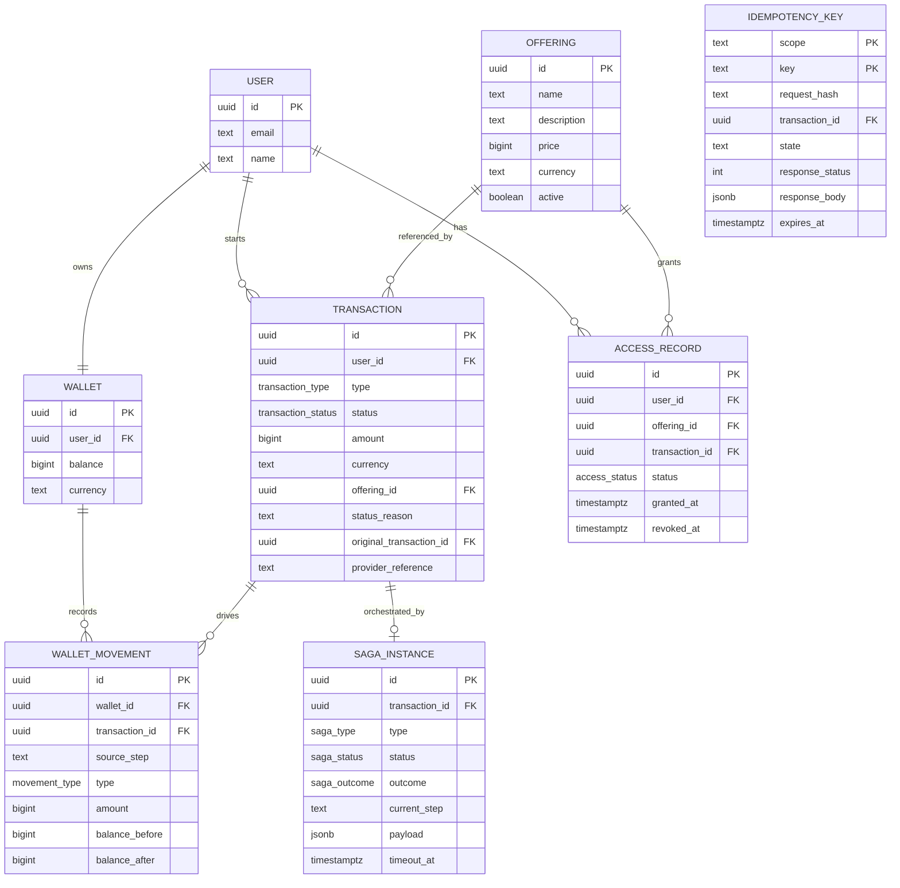

# Data Model

## Overview

The solution uses one PostgreSQL instance with one schema per service.

- `payments`
- `wallets`
- `catalog_access`
- `saga_orchestrator`

This keeps local development simple while preserving data ownership boundaries.

## Entity View

## Payments Schema

### `payments.transactions`

Purpose:
- authoritative ledger for deposit, purchase, and refund

Important columns:

- `id`
- `user_id`
- `type`
- `status`
- `amount`
- `currency`
- `offering_id`
- `status_reason`
- `original_transaction_id`
- `provider_reference`
- `created_at`
- `updated_at`

### Transaction Status Model

Supported statuses:

- `pending`
- `completed`
- `failed`
- `timed_out`
- `compensated`
- `reconciliation_required`

Legal transitions:

- `pending -> completed`
- `pending -> failed`
- `pending -> timed_out`
- `pending -> compensated`
- `pending -> reconciliation_required`
- `timed_out -> completed`
- `timed_out -> failed`
- `timed_out -> reconciliation_required`

## Wallets Schema

### `wallets.wallets`

Purpose:
- current operational balance per user

Important columns:

- `id`
- `user_id`
- `balance`
- `currency`
- `created_at`
- `updated_at`

### `wallets.wallet_movements`

Purpose:
- wallet-local journal of applied balance mutations

Important columns:

- `wallet_id`
- `transaction_id`
- `source_step`
- `type`
- `amount`
- `balance_before`
- `balance_after`

Important constraint:

- unique `(transaction_id, source_step)`

That constraint is the core wallet-side idempotency guard.

## Catalog Access Schema

### `catalog_access.users`

Minimal user registry needed by the flows.

### `catalog_access.offerings`

Minimal offering catalog with:

- `price`
- `currency`
- `active`

### `catalog_access.access_records`

Purpose:
- track active or revoked access granted by purchases

Important columns:

- `user_id`
- `offering_id`
- `transaction_id`
- `status`
- `granted_at`
- `revoked_at`

Important constraints:

- one active access per `(user_id, offering_id)`
- one grant per `transaction_id`

This allows repurchase with a new transaction while preventing stale replay of
an old purchase from re-granting access.

## Saga Schema

### `saga_orchestrator.saga_instances`

Purpose:
- durable workflow state for distributed transactions

Important columns:

- `transaction_id`
- `type`
- `status`
- `outcome`
- `current_step`
- `payload`
- `timeout_at`

### `saga_orchestrator.idempotency_keys`

Purpose:
- persist command-ingress idempotency results

Important columns:

- `scope`
- `key`
- `request_hash`
- `transaction_id`
- `state`
- `response_status`
- `response_body`
- `expires_at`

Important behavior:

- the key is scoped, so `deposit`, `purchase`, and `refund` do not share a
  global idempotency namespace
- reservations can be `processing` or `completed`
- retryable failures release a reservation instead of caching a final error

## Important Honest Note

The saga status enum still contains `created`, because it exists in the schema
and domain model. The runtime, however, now creates sagas directly as
`running`. That is a small residual cleanup target rather than an active
workflow state in the normal flow.
