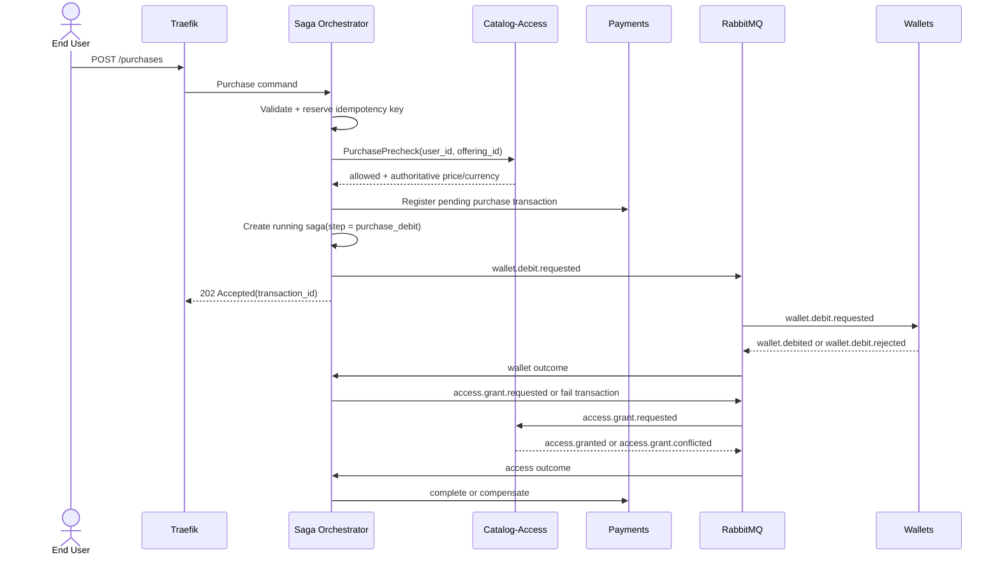
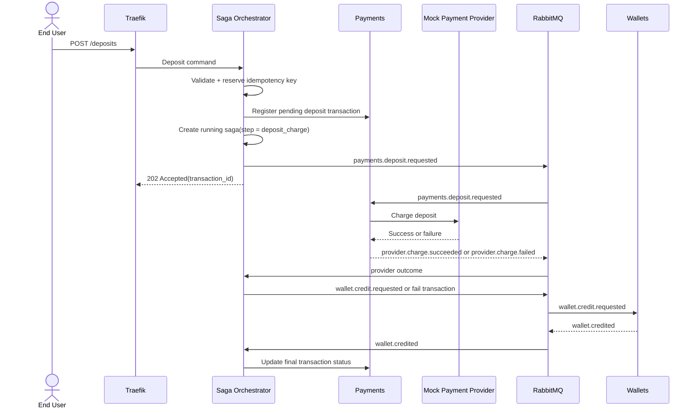
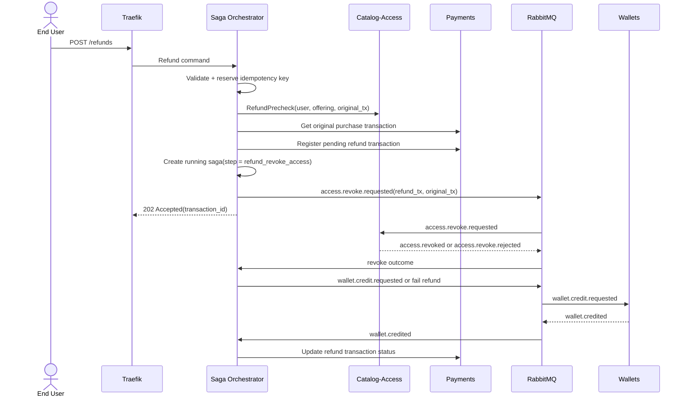

# Workflows

## Supported Functionality

The system supports:

- deposit funds into a wallet through a mocked provider
- purchase an offering with wallet balance
- refund a previous purchase by revoking access and crediting the wallet
- query transaction history, wallet balance, and active entitlements

## Purchase

### Important Behavior

- price and currency come from `catalog-access`, not from the client
- the purchase transaction is registered before the saga starts
- insufficient funds fail the transaction without compensation
- access conflict after a successful debit triggers wallet compensation

## Deposit

### Important Behavior

- `payments` owns provider invocation and provider-result publication
- deposit processing is idempotent by `transaction_id`
- provider reference is persisted in the transaction ledger
- the timeout poller can move a deposit to `timed_out`
- a late provider outcome can still legally resolve a timed-out deposit

## Refund

### Important Behavior

- the client provides the original purchase transaction ID
- the refund amount and currency come from the original purchase transaction in
  `payments`
- the revoke command carries:
  - the refund transaction ID
  - the original purchase transaction ID
- only a successful revoke can trigger the wallet credit

## Read Paths

The orchestrator does not serve read models.

Reads go directly to the owning service:

- `payments` for transaction detail and transaction history
- `wallets` for current balance
- `catalog-access` for active entitlements

## Challenge Scenarios Covered

### Happy Path

- successful deposit
- successful purchase
- successful refund

### Insufficient Funds

- wallet debit is rejected
- purchase ends as `failed`
- no access is granted

### Provider Timeout

- timeout poller marks the saga and transaction as `timed_out`
- a late provider result can still complete or fail the deposit if the state
  transition is still legal

### Concurrent Payments

- ingress idempotency blocks duplicate client commands for the same key
- wallet row locking serializes concurrent wallet mutations
- access uniqueness prevents two active grants for the same user and offering
- stale or duplicated outcome events are ignored by saga step gating
